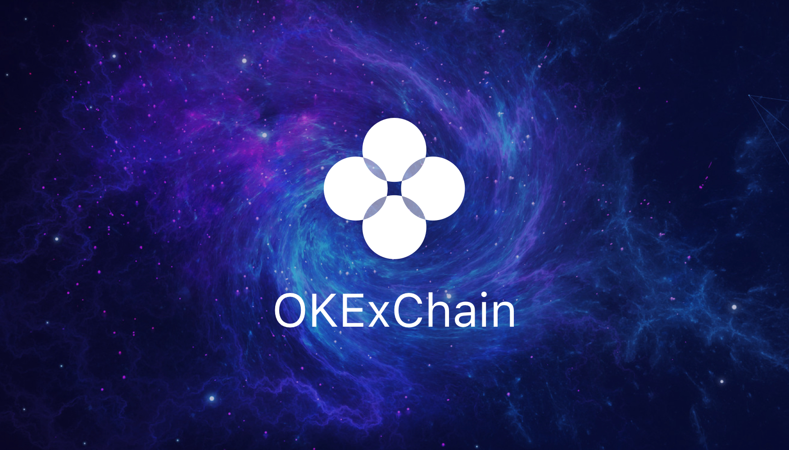
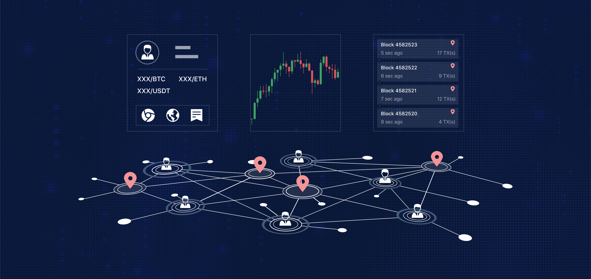

# Introduction

## What is faStock-Chain?

faStock-Chain is a set of open-source blockchain projects developed by faStock, aiming to promote the development of large-scale commercial applications based on blockchain technology. It gives each participating node the same rights, allowing users to launch a variety of decentralized applications smoothly, issue their digital assets, create their own digital asset trading pairs, and trade freely. The utilisation of cross-chain technology principles is essential to allow those features to be used by anyone. Through the cross-chain module, the value interconnectivity and user interconnectivity, interconnectivity of blockchain can be realized simply and efficiently, so that we can co-construct the ecosystem and the value-added system.

## What is faStock Exchange?

faStock Exchange, is the first project born from the faStock-Chain ecosystem and is a middleware that can freely issue DEX. With the design concept of “everyone can create DEX”, it provides various basic functions needed to operate a DEX. Compared with traditional DEX, faStock adopts a full on-chain matching and an on-chain order book management to make matching information more transparent and safe; compared with Ethereum-based projects, the matching engine based on faStock-Chain’s call auction can achieve matching in seconds, which is similar to the operating experience offered by centralized exchange. In addition, its unique design idea is not to build a DEX belonging to a certain stakeholder, but to provide a platform to achieve the separation of technology and operations. Just as Ethereum makes digital asset issuance simple through smart contract technology, faStock-Chain lowers the barrier for operating digital asset trading pairs with faStock.

## The OKT

Do you have OKT tokens? With OKT, you have the unique ability to contribute to the security and governance of the faStock-Chain. Delegate your OKT to one or more of the 100 validators on the faStock-Chain blockchain to earn more OKT through Proof-of-Stake. You can also vote with your OKT to influence the future of the faStock-Chain through on-chain governance proposals.

Learn more about [being a delegator](./delegators/delegators-faq.html).

## faStock-Chain Explorer

The faStock-Chain block explorer allows you to search, view and analyze faStock-Chain data—like blocks, transactions, validators as well as other key information.

* [OKlink](https://www.oklink.com)

## faStock-Chain CLI

`fastock-chain-cli` is a command-line interface that lets you interact with the faStock-Chain. `fastock-chain-cli` is the only tool that supports 100% of the faStock-Chain features, including accounts, transfers, delegation, and governance. Learn more about fastock-chain-cli with the [delegator's CLI guide](./delegators/delegators-guide-cli.html).

## Running a full-node on the faStock-Chain Testnet

In order to run a full-node on the faStock-Chain testnet, you must first [install `fastock-chain-daemon`](./getting-start/install-fastock-chain.html). Then, follow [the guide](./getting-start/install-fastock-chain.html).

If you would like to run a validator node, follow the [validator setup guide](./validators/validators-guide-cli.html).

## Join the Community

Have questions, comments, or ideas? Feel free to participate and to become part of the faStock-Chain community through one of the following channels.

* [faStock-Chain Validator Chat](https://t.me/joinchat/HuUCNktBLftzEY1fZPStkw)
* [faStock-Chain Developer Chat](https://t.me/fastocktech)

## Version

The version of the program relating to this documentation is: 0.10

