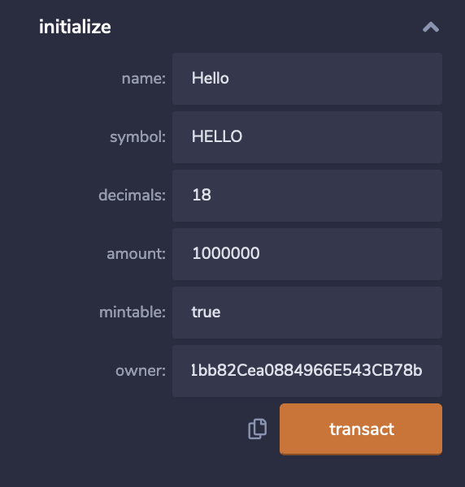
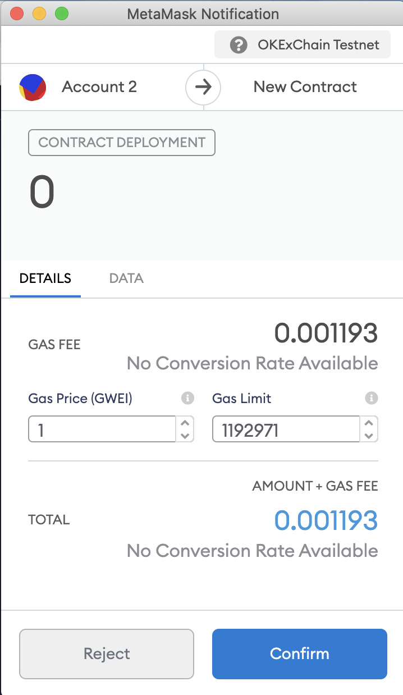
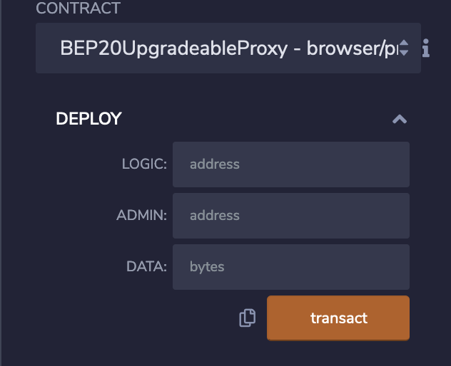
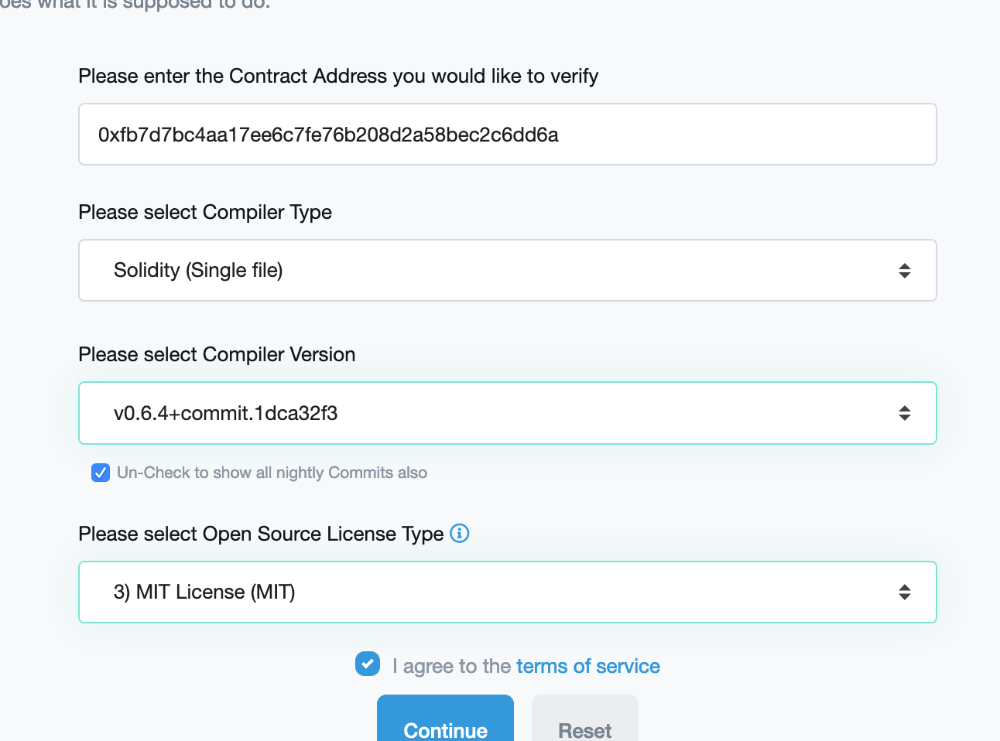
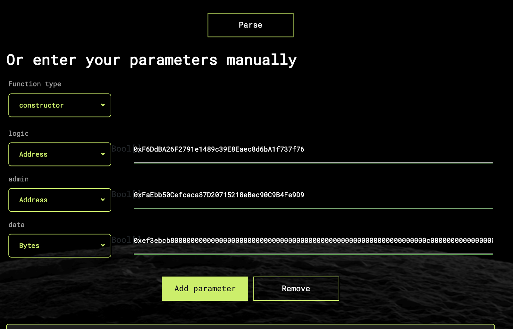
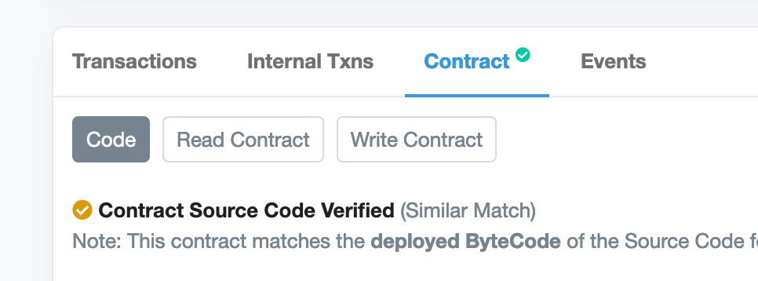
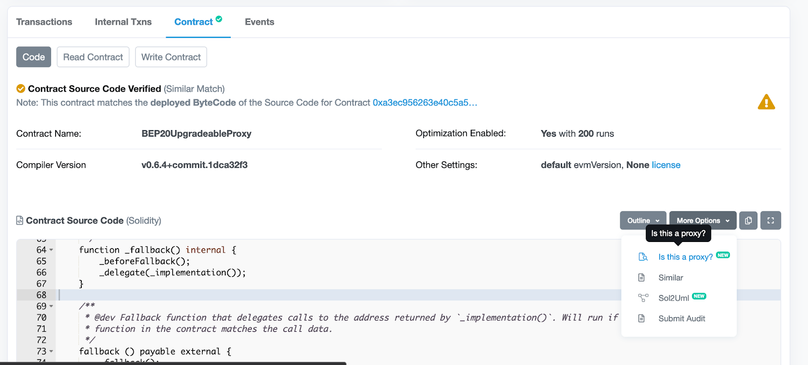
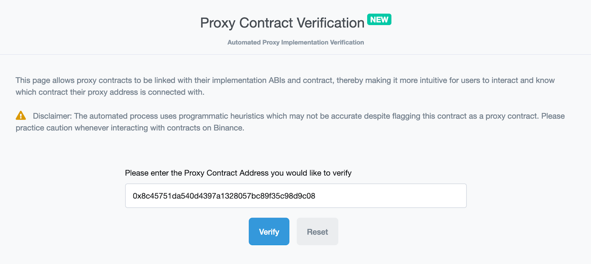
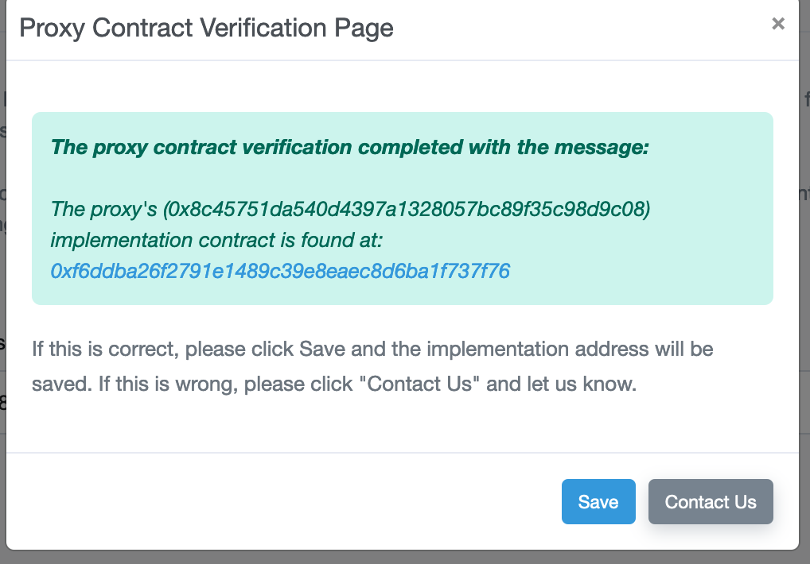

# Verify Proxy Contract
### How to Verify Proxy Contract
Please learn how to deploy an upgradable OIP20 contract <!--here-->
### Flatten your contract
#### Install flattener
```npm install truffle-flattener -g```

Run the following command:
```
$ truffle-flattener OIP20TokenImplementation.sol > OIP20TokenImplementationFlattened.sol
$ truffle-flattener OIP20UpgradeableProxy.sol > OIP20UpgradeableProxyFlattened.sol"
```
### Compile and deploy your contract with Remix
#### Compile Implementation contract
- Open Remix IDE:[https://remix.ethereum.org](https://remix.ethereum.org)
- Select solidity language
- Create new contract OIP20Token.sol and copy contract code from flattened OIP20TokenImplementationFlattened.sol
- Compile the implementation contract
- Click on this button to switch to the compile page
- Select “OIP20TokenImplementation” contract
- Enable “Auto compile” and “optimization”
- Click “ABI” to copy the contract abi and save it.
### Deploy the implementation contract
- Select “Injected Web3”
- Select “OIP20TokenImplementation” contract
- Click the “Deploy” button and Metamask will pop up
- Click the “confirm” button to sign and broadcast the transaction to faStock.
- Then, you need to initialize the token: fill in all the parameters and click on “transact”

> Note: Owner should be the address who send the deploy transaction before.
- Click on the “Copy” icon to save the initializatioin data: Like the following: 
```0xef3ebcb800000000000000000000000000000000000000000000000000000000000000c00000000000000000000000000000000000000000000000000000000000000100000000000000000000000000000000000000000000000000000000000000001200000000000000000000000000000000000000000000000000000000000f42400000000000000000000000000000000000000000000000000000000000000001000000000000000000000000fc41d5571120442d1bb82cea0884966e543cb78b000000000000000000000000000000000000000000000000000000000000000548656c6c6f000000000000000000000000000000000000000000000000000000000000000000000000000000000000000000000000000000000000000000000548454c4c4f000000000000000000000000000000000000000000000000000000```
- Confirm your transaction in MetaMask

### Compile Proxy Contract
- Create new contract proxy.sol and copy contract code from flattened
`OIP20UpgradeableProxyFlattened.sol`. <!--Here is and [example]()-->
- Compile the proxy contractClick on this button to switch to the compile page
- Select “OIP20UpgradeableProxy” contract
- Enable “Auto compile” and “optimization”Click “ABI” to copy the contract abi and save it.
### Deploy the proxy contract
- Select “Injected Web3”Select “OIP20UpgradeableProxy.sol” contract
- Fill in the parameter
<!---->
Logic: The address of OIP20Implementation contract Admin: admin cannot be OIP20 token owner
Data: use the initialization data you saved before
- Click the “Deploy” button and Metamask will pop up
- Click the “confirm” button to sign and broadcast transaction to faStock-Chain.
### Verify Proxy Contract on OKLink
Note: The way to verify the OIP20TokenImplementation contract is the same as before.
- Go to your contact page and click on “Verify and Publish”

-Select Single file

- Copy your contract code below and check “Optimization” if it’s enabled
- Contractor Data: Please use this site for getting the correct constructor data: https://abi.hashex.org/#

First, you need to copy ABI json of “OIP20UpgradeableProxy.sol” contractThen, click on “Parse”

Add all those 3 parameters as indicated. Then copy/paste the result.

That’s it! You have verified your proxy contract.

### Link these two contracts
- Click on “More Options” and choose “is this a proxy”.

- Verify your proxy address

Confirm the implementation address.

If you go back to the contract page and you can see two more buttons “Read as Proxy” and “Write as Proxy”

