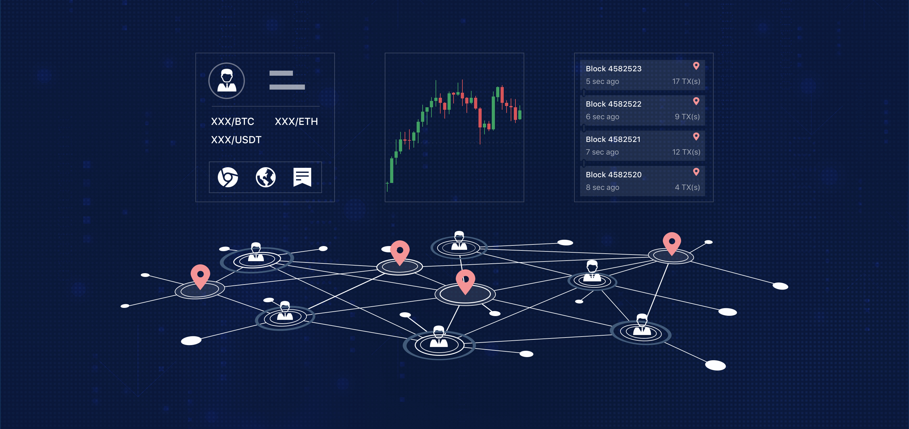

<!--
order: 1
-->

# Introduction

## What is faStock-Chain?

faStock-Chain is the world's first trading chain — blockchain technology built for trading. It is the next step in the development of decentralized trading, where people can trade anything of value on-chain, and own and control the assets that they trade.

faStock-Chain provides safe and efficient infrastructure for creating decentralized applications for seamless on-chain trading of all kinds of assets within a cross-chain, value-exchange ecosystem.

In developing this open-source, trading-focused blockchain technology, faStock has focused on providing lower operational costs for blockchain developers looking to build new decentralized-trading applications. This means lower fees for end-users of DApps based on faStock-Chain. We also designed faStock-Chain to level up user-experience standards for decentralized trading — faStock-Chain's base layer is optimized to provide the best trading performance and experience

## What is Blockchain middleware?
Normally in blockchain industry, developers are categorized as follows： 

* The first one is the public chain developer, responsible for development on underlying technology. Public chain development is featured on a long R&D cycle and high entry barrier.

* The second one is the infrastructure developer, responsible for  infrastructure development, such as wallet, blockchain explorer, exchange, etc.

* The third one is the app developer, responsible for application development, such as DeFi App in 2020. These kinds of developers have higher requirements on technical and operational innovation.

As the development of the Internet, public chains would undertake more complex business with the maturity of blockchain technology. Therefore, decentralized business will require an in-depth development environment. faStock-Chain is just designed for these developers.

In the Internet app, middleware is the software building the bridge between system software and application software.Middleware enables applications to share information and resources between different technical architectures,such as process scheduling, message queue, data storage, transaction processing, etc., and it is widely used in energy, telecommunications, finance, banking, medical care, education and other industry software, reducing the software development cost.

Based on that, faStock-Chain proposes the concept of "blockchain middleware" to reduce the development cost for application developers.

## What is faStock Exchange?

faStock Exchange, is the first project born from the faStock-Chain ecosystem and is a middleware that can freely issue DEX. With the design concept of “everyone can create DEX”, it provides various basic functions needed to operate a DEX. Compared with traditional DEX, faStock adopts a full on-chain matching and an on-chain order book management to make matching information more transparent and safe; compared with Ethereum-based projects, the matching engine based on faStock-Chain’s call auction can achieve matching in seconds, which is similar to the operating experience offered by centralized exchange. In addition, its unique design idea is not to build a DEX belonging to a certain stakeholder, but to provide a platform to achieve the separation of technology and operations. Just as Ethereum makes digital asset issuance simple through smart contract technology, faStock-Chain lowers the barrier for operating digital asset trading pairs with faStock.

## The OKT

Do you have OKT tokens? With OKT, you have the unique ability to contribute to the security and governance of the faStock-Chain. Delegate your OKT to one or more of the 100 validators on the faStock-Chain blockchain to earn more OKT through Proof-of-Stake. You can also vote with your OKT to influence the future of the faStock-Chain through on-chain governance proposals.

It is required to stake at least 10,000 OKT in order to apply to become a validator. Besides, a certain amount of OKT need to be deposited to submit a chain-governance proposal or execute an order pending operation.

OKT holders obtain voting rights by staking their tokens. One address can vote for up to 30 different validator candidates, and the number of votes for each validator candidate that the address has supported is equivalent to the amount of OKT the address has staked (1 OKT = 1 vote).

Learn more about [being a delegator](../delegators/delegators-faq.html).

## faStock-Chain Explorer

The faStock-Chain block explorer allows you to search, view and analyze faStock-Chain data—like blocks, transactions, validators as well as other key information.

* [OKlink](https://www.oklink.com)

## faStock-Chain CLI

`fastock-chain-cli` is a command-line interface that lets you interact with the faStock-Chain. `fastock-chain-cli` is the only tool that supports 100% of the faStock-Chain features, including accounts, transfers, delegation, and governance. Learn more about fastock-chain-cli with the [delegator's CLI guide](./delegators/delegators-guide-cli.html).

## Running a full-node on the faStock-Chain Testnet

In order to run a full-node on the faStock-Chain testnet, you must first [install `fastock-chain-daemon`](./getting-start/install-fastock-chain.html). Then, follow [the guide](./getting-start/install-fastock-chain.html).

If you would like to run a validator node, follow the [validator setup guide](./validators/validators-guide-cli.html).

## Join the Community

Have questions, comments, or ideas? Feel free to participate and to become part of the faStock-Chain community through one of the following channels.

* [faStock-Chain Validator Chat](https://t.me/joinchat/HuUCNktBLftzEY1fZPStkw)
* [faStock-Chain Developer Chat](https://t.me/fastocktech)

